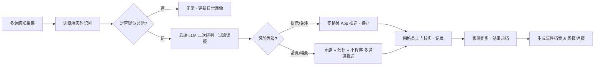

# AI 社区独居老人智能巡检与安全预警系统 · 需求规格说明书（PRD v1.2）

> 文档版本：v1.2（评审完成 · 冻结版 · 2026-06-17）
> 项目代号：Silver Guard（智护长者）
> 适用对象：产品 / 后端 / 前端 / AI 算法 / 测试 / 社区运营
> 撰写日期：2026-06-17
> 评审结论：✅ 两场评审均通过，2026-06-17 正式冻结，进入开发阶段

---

## 一、文档说明

### 1.1 目的
本文档用于向研发团队清晰传达「AI 社区独居老人智能巡检与安全预警系统」的业务目标、使用场景、功能需求、数据结构、接口约束、非功能需求及验收标准，作为需求评审、开发排期、测试用例编写与上线验收的依据。

### 1.2 范围
- **包含**：长者端感知、AI 异常研判、网格员端（Web + App）、家属端小程序、社区管理后台、预警通知通道
- **暂不包含**：线下硬件采购与部署工程、医保/民政系统对接、医疗诊断/处方开具

### 1.3 术语表

| 术语 | 解释 |
| --- | --- |
| 独居老人 | 长期独自居住、无子女或子女不在身边的 60+ 岁居民 |
| 网格员 | 社区/街道负责基层治理、日常巡检与关怀的一线工作人员 |
| 多源感知 | 毫米波雷达、红外人体感应、门窗/水浸/烟雾传感器、智能手环等多终端 |
| 异常识别 | 对跌倒、久卧不起、长时间静止、异常离床等行为的 AI 识别 |
| 分级预警 | 按风险等级将事件分为 4 级（提示 / 关注 / 紧急 / 特急） |
| 边缘计算 | 在家庭侧网关就近完成的低时延、隐私友好的本地计算 |
| LLM | 大语言模型，用于自然语言研判、摘要生成、工单自动生成 |

---

## 二、项目概述与目标

### 2.1 背景（Why）
- 中国 65 岁以上老年人口超 **1.4 亿**，独居老人超 **2800 万**，高龄化与空巢化加速。
- 社区网格员人均对接 200+ 户，人力巡检存在"看不全、到不了、响应慢"的结构性缺口。
- 跌倒、突发疾病、长时间未活动等居家异常，往往发现滞后 **3 小时以上**，错过黄金救援窗口。

### 2.2 目标（What）

| 指标 | 目标值 | 度量周期 |
| --- | --- | --- |
| 异常事件发现响应时间 | ≤ 30 秒 | 月度 |
| 网格员日均巡检覆盖提升 | ≥ 60% | 季度 |
| 独居老人居家意外率 | 同比下降 ≥ 30% | 年度 |
| 系统整体可用性 | ≥ 99.5% | 月度 |
| 误报率（经人工核实） | ≤ 10% | 月度 |

### 2.3 成功判据（Go-live Criteria）
1. 首批试点社区 **3 个街道 / 100 户**接入并稳定运行 30 天。
2. 预警响应平均耗时 ≤ 30 秒，网格员处置闭环率 ≥ 95%。
3. 无一起因系统故障导致的预警遗漏 P0 事故。
4. 老人与家属满意度问卷得分 ≥ 4.2 / 5。

---

## 三、用户画像与用户故事

### 3.1 用户画像

**Persona 1 · 张奶奶（78 岁 · 独居 · 轻度高血压）**
- 特征：能自理但行动渐缓，子女在外地，每周电话联系；家中有智能手环与门口感应器。
- 核心诉求：**在家有安全感、不被打扰、出事有人管**。

**Persona 2 · 李姐（社区网格员 · 42 岁 · 负责 260 户）**
- 特征：手机重度使用者，熟悉社区工作 App；每天有走访清单、记录与回传任务。
- 核心诉求：**减少纸质与重复录入、工作清单按优先级排序、有异常能第一时间提醒**。

**Persona 3 · 王先生（家属 · 45 岁 · 工程师）**
- 特征：在外地工作，每月回家一次；愿为父母的安全设备付费。
- 核心诉求：**随时了解父母状态、紧急情况第一时间收到通知、操作界面要"傻瓜式"**。

**Persona 4 · 赵主任（街道智慧养老负责人 · 50 岁）**
- 特征：关注运营成本、可持续性、数据合规；需向上级汇报养老服务成效。
- 核心诉求：**数据看板清晰、可生成报表、可按需扩展、成本可控**。

### 3.2 用户故事（优先级 P0 > P1 > P2）

| ID | 用户故事 | 优先级 | 验收要点 |
| --- | --- | --- | --- |
| US-01 | 作为张奶奶，我希望在家里的活动被"默默守护"，不需要我操作，就能在出事时及时通知家人与社区。 | P0 | 跌倒/静止异常自动识别并触发预警；老人侧零操作。 |
| US-02 | 作为网格员，我希望每天打开 App 能看到"今日重点巡检清单"，按风险高低排序，避免盲目走访。 | P0 | App 首页按风险等级展示今日巡检对象，支持打卡与记录。 |
| US-03 | 作为家属，我希望能收到父母的异常预警（微信/短信/电话），并能查看 24 小时活动概况。 | P0 | 家属小程序支持实时通知与历史曲线查看。 |
| US-04 | 作为网格员，我希望在接到预警后，能一键导航、一键电话、一键生成工单，处置流程留痕。 | P1 | 预警详情页含"电话/导航/上门记录/转交"动作。 |
| US-05 | 作为街道负责人，我希望有一个驾驶舱大屏，能看到本辖区风险分布、处置进度、周报月报。 | P1 | 管理后台提供仪表盘、地图热力与时间维度报表。 |
| US-06 | 作为老人，我希望隐私被严格保护，数据不被用于广告或非养老用途。 | P0 | 数据最小化原则；家属可查看授权范围；支持一键注销。 |

---

## 四、业务流程

### 4.1 主流程：异常发现 → 预警 → 处置 → 闭环



### 4.2 子流程一：日常巡检（网格员端）
1. 系统于每日 08:00 根据"近期预警 + 高危老人 + 走访周期"自动生成**巡检清单**。
2. 网格员按清单走访，App 内打卡、记录（文字/语音/图片）。
3. 老人异常记录由 LLM 自动摘要为结构化事件。
4. 当日 21:00 自动生成完成率报表并推送至管理员。

### 4.3 子流程二：紧急事件（夜间）
1. 夜间 22:00–次日 06:00，识别到"跌倒 / 长时间静止 / 离床未归 > 30 分钟"。
2. 触发**特急预警**：网格员 App 强提醒 + 电话回拨 + 家属短信。
3. 10 分钟内未响应，自动升级至社区值班、街道值班。
4. 形成夜间事件报告并在次日晨会上摘要展示。

---

## 五、功能需求（Functional Requirements）

### 5.1 模块清单

```
Silver Guard 平台
├── M-01 感知接入与数据网关
├── M-02 AI 异常研判引擎
├── M-03 分级预警与通知中心
├── M-04 网格员端 App（iOS / Android / 小程序）
├── M-05 家属端小程序
├── M-06 社区/街道管理后台 Web
├── M-07 事件档案与数据报表
└── M-08 权限与系统管理
```

### 5.2 模块详细需求

#### M-01 感知接入与数据网关
- FR-01.1：支持 MQTT / HTTP / WebSocket 三类协议接入，默认使用 MQTT。
- FR-01.2：设备类型：毫米波雷达、人体红外、门窗传感、水浸/烟雾/燃气、SOS 按钮、智能手环。
- FR-01.3：每个设备上报数据必须包含 `device_id / timestamp / event_type / payload / signature`。
- FR-01.4：边缘端本地缓存 ≥ 4 小时，断网恢复后自动补传，保证数据时序性。
- FR-01.5：数据网关支持设备在线/离线状态检测；离线 > 10 分钟生成"设备异常"提示。

#### M-02 AI 异常研判引擎
- FR-02.1：识别事件类型（V1 必做）：跌倒、长时间静止 ≥ 2h、夜间离床 ≥ 30min、门窗异常开启（深夜）、SOS 主动呼叫。
- FR-02.2：识别事件类型（V2 可选）：进食/饮水缺失、步态异常、情绪/声音异常。
- FR-02.3：风险等级模型：`L1 提示` / `L2 关注` / `L3 紧急` / `L4 特急`，等级可在后台配置阈值。
- FR-02.4：**误报过滤**：云端 LLM 结合该老人近 30 天作息画像做二次判别；置信度 < 0.6 不告警，仅记入日常画像。
- FR-02.5：AI 模型版本管理：后台支持模型版本切换、A/B 实验、准确率/召回率看板。

#### M-03 分级预警与通知中心
- FR-03.1：L3/L4 必须在 **30 秒内**触达至少一位网格员。
- FR-03.2：通知通道：App 推送（优先）、短信、电话回拨、微信服务号、Webhook。
- FR-03.3：**升级机制**：10 分钟无人认领 → 通知第二责任人；20 分钟无人响应 → 自动通知社区/街道值班。
- FR-03.4：每一次通知均需"已读 / 到场 / 处置 / 关闭"四节点状态流转，全程留痕。
- FR-03.5：家属可在小程序中自主配置通知级别（如仅接收 L3+）。

#### M-04 网格员端 App
- FR-04.1：登录：手机号 + 短信 / 统一身份认证（SSO，按街道配置）。
- FR-04.2：首页三区域：**紧急预警列表（置顶）** / **今日巡检清单** / **数据概览**。
- FR-04.3：巡检任务：按优先级排序、支持打卡、拍照、语音、文字、标记"需再次回访"。
- FR-04.4：预警详情：老人基本信息、设备信号摘要、处置建议（LLM 生成）、一键电话/导航/转交。
- FR-04.5：消息中心区分"系统 / 预警 / 巡检 / 通知"四类。
- FR-04.6：离线可用：巡检与预警可离线缓存，联网后自动回传。

#### M-05 家属端小程序
- FR-05.1：家属注册：需老人本人/网格员授权绑定（避免陌生绑定）。
- FR-05.2：首页：**老人今日概况** + 近 7 天活动曲线 + 最新预警摘要。
- FR-05.3：事件详情：时间线、处置人、处置结果、可留言互动。
- FR-05.4：授权管理：家属可选择关闭/打开查看某些数据维度（如心率细节）。
- FR-05.5：一键联系网格员/社区。

#### M-06 社区/街道管理后台 Web
- FR-06.1：驾驶舱大屏：辖区风险热力图、实时预警看板、处置统计。
- FR-06.2：用户与老人档案管理：录入/导入/导出（受控权限）。
- FR-06.3：设备与阈值配置：老人画像分组、个性化阈值、模型切换。
- FR-06.4：工单与事件：筛选、导出、复核、催办。
- FR-06.5：权限：社区管理员、街道管理员、平台管理员三级；敏感操作需审计日志。

#### M-07 事件档案与数据报表
- FR-07.1：事件档案字段：老人、时间、类型、等级、研判依据、处置人、处置结果、备注。
- FR-07.2：自动生成：**周报 / 月报**（LLM 摘要 + 数字指标 + 典型案例脱敏）。
- FR-07.3：支持按街道、社区、时间段导出 CSV / PDF。
- FR-07.4：报表字段最小集合：预警次数、响应时间、处置闭环率、Top 风险老人、误报率。

#### M-08 权限与系统管理
- FR-08.1：基于 RBAC：角色（超级管理员/街道/社区/网格员/家属/运营/审计）。
- FR-08.2：所有变更操作（新增/修改/删除/阈值调整）进入审计日志，不可篡改。
- FR-08.3：账号安全：密码策略、登录 IP 白名单、双因素登录（管理员）。

---

## 六、数据模型（核心实体 ER 草图）

### 6.1 核心实体

```
[社区 Community] ─1:N─ [用户 User]
                    └1:N─ [老人 Elder] ─1:N─ [设备 Device]
                                       └1:N─ [事件 Event] ─1:N─ [通知 Notification]
                                       └1:N─ [日常画像 DailyProfile]
[工单 WorkOrder] ─N:1─ [事件 Event]
[工单 WorkOrder] ─N:1─ [用户 User（处置人）]
```

### 6.2 关键字段（示意，供后端建表参考）

**Elder（老人档案）**
- `id`, `name`, `id_card_hash`, `gender`, `birth`, `address`, `community_id`, `risk_level`, `tag[]`, `emergency_contact[]`, `created_at`, `updated_at`

**Device（设备）**
- `id`, `elder_id`, `type`（RADAR/IR/DOOR/SMOKE/SOS/BAND）, `vendor`, `sn`, `meta_json`, `online_at`, `status`（ONLINE/OFFLINE/FAULT）

**Event（事件）**
- `id`, `elder_id`, `type`, `level`（L1-L4）, `source`, `confidence`, `evidence_json`, `first_report_at`, `assigned_user_id`, `status`（OPEN/ASSIGNED/ONGOING/CLOSED/FALSE_ALARM）, `closed_by`, `closed_at`

**Notification（通知）**
- `id`, `event_id`, `channel`, `receiver_id`, `receiver_type`, `sent_at`, `read_at`, `ack_status`, `fail_reason`

**DailyProfile（日常画像）**
- `id`, `elder_id`, `date`, `activity_score`, `sleep_summary_json`, `hr_avg`, `steps`, `warning_count`, `anomaly_signals_json`

**AuditLog（审计日志）**
- `id`, `actor_id`, `action`, `target_type`, `target_id`, `before_json`, `after_json`, `ip`, `ua`, `created_at`

---

## 七、接口清单（API 提纲）

> 详细 Swagger/OpenAPI 由后端在实现阶段产出，此处列出必须覆盖的接口分组。

### 7.1 账号与权限
- `POST /api/v1/auth/login`（手机号+验证码 / SSO / 账号密码）
- `POST /api/v1/auth/logout`
- `GET /api/v1/auth/me`
- `POST /api/v1/auth/2fa/verify`（管理员）

### 7.2 老人与档案
- `GET /api/v1/elders`（列表 / 搜索 / 筛选）
- `POST /api/v1/elders`（新增）
- `GET /api/v1/elders/:id`
- `PUT /api/v1/elders/:id`
- `POST /api/v1/elders/:id/bind-family`（家属绑定审核）

### 7.3 设备与上报
- `POST /api/v1/devices/report`（MQTT 网关转发后的统一入口）
- `GET /api/v1/devices?elder_id=`
- `PUT /api/v1/devices/:id/threshold`（个性化阈值）
- `GET /api/v1/devices/:id/history`

### 7.4 AI 研判与事件
- `POST /api/v1/ai/judge`（内部：云端二次研判）
- `GET /api/v1/events`（按等级/状态/时间筛选）
- `GET /api/v1/events/:id`
- `POST /api/v1/events/:id/assign`
- `POST /api/v1/events/:id/handle`（到场/处置/关闭）
- `POST /api/v1/events/:id/remark`

### 7.5 网格员巡检
- `GET /api/v1/patrol/daily-tasks`（今日清单）
- `POST /api/v1/patrol/checkin`（打卡）
- `POST /api/v1/patrol/records`（提交记录）

### 7.6 通知与订阅
- `GET /api/v1/notifications?target=`
- `POST /api/v1/notifications/preferences`（家属/网格员偏好）
- `POST /api/v1/webhooks/test`

### 7.7 后台与报表
- `GET /api/v1/dashboard/summary`
- `GET /api/v1/dashboard/heatmap`
- `GET /api/v1/reports/weekly?from=&to=`
- `GET /api/v1/audit-logs`（仅审计）

---

## 八、非功能需求（NFRs）

### 8.1 性能（Performance）
- NFR-P1：**L3/L4 预警从数据上报到首条通知送达 ≤ 30 秒**（95 分位）。
- NFR-P2：驾驶舱首页加载 ≤ 2 秒；列表接口 1000 条数据分页响应 ≤ 500ms。
- NFR-P3：系统应支持单部署单元 ≥ 5000 户老人并发，支持水平扩展。

### 8.2 可用性与稳定性（Availability）
- NFR-A1：全年可用性 ≥ 99.5%，计划内维护窗口 ≥ 7 天预告。
- NFR-A2：关键链路（网关—研判—通知）具备主备/降级方案，任何单点故障不影响核心告警。
- NFR-A3：每日自动备份，异地留存 ≥ 30 天。

### 8.3 安全与合规（Security & Compliance）
- NFR-S1：**隐私优先**。影像/语音等敏感数据不入库，仅在边缘端本地研判或脱敏后上传。
- NFR-S2：身份证号等 PII 字段使用不可逆哈希（用于去重）+ 可选择字段级加密（用于查阅）。
- NFR-S3：所有对外接口走 HTTPS / MQTTS；内部关键接口调用需签名或鉴权。
- NFR-S4：符合《个人信息保护法》《数据安全法》及地方民政/卫健行业规定。
- NFR-S5：支持数据导出与删除请求（被遗忘权），15 天内完成。

### 8.4 可观测性（Observability）
- NFR-O1：接入统一日志、指标、链路追踪（LOG / METRICS / TRACE）。
- NFR-O2：P0 故障（预警通道失败、研判失败）自动触发值班告警。
- NFR-O3：对外暴露健康检查接口 `/health`。

### 8.5 可扩展性与可维护性（Extensibility）
- NFR-E1：按 DDD 分层（interface / application / domain / infrastructure），业务与技术解耦。
- NFR-E2：通知通道、模型版本、设备协议以插件/策略模式接入，便于后续扩展。

### 8.6 本地化与可用性（老人侧体验）
- NFR-U1：老人端**无主动操作**要求；如需操作设备，按钮需大号、高对比、语音提示。
- NFR-U2：家属与网格员端界面支持大字号模式与暗色模式。

---

## 九、技术栈方案（基于团队现有技术栈）

> **说明**：以下技术选型直接复用团队已有的 Java + Spring Boot + LangChain4j 技术栈，不引入额外学习成本。项目代号 **Silver Guard**，目标技术评审时确认架构分层与模块归属。

---

### 9.1 Java 核心后端

| 类别 | 技术 | 在本项目中的用途 |
| --- | --- | --- |
| 语言/运行时 | **Java 21** + Virtual Threads | 高并发预警推送、AI 研判任务异步化 |
| 框架 | **Spring Boot 3**、Spring MVC、Spring AOP（@Around） | 主体 REST API、切面（日志/权限/限流） |
| 安全 | **Spring Security** + 自定义注解 + AOP | JWT 认证、RBAC 权限校验（网格员/家属/管理员） |
| ORM | **MyBatis Flex**（LambdaQueryWrapper、自定义代码生成） | 老人档案、设备、事件、通知等所有数据访问层 |
| 工具库 | **Hutool**、**Lombok**、**Knife4j**（API 文档） | 工具函数、减少样板代码、接口文档自动化 |
| 规范 | Alibaba Java Coding Guidelines | 团队代码风格统一 |
| 设计模式 | Facade（统一网关）、Strategy（预警等级策略）、Template Method（事件处理模板）、Factory（通知渠道工厂）、Executor（自定义线程池） | AI 研判流程编排、统一异常处理、预警分发 |
| API | RESTful + **Global Exception Handler** | 全链路统一错误码、业务异常体系 |

---

### 9.2 LLM / AI 应用层

| 类别 | 技术 | 在本项目中的用途 |
| --- | --- | --- |
| AI 框架 | **LangChain4j**（AI Service、Structured Output、Input/Output Guardrails、Tool Calling、Chat Memory） | AI 二次研判、事件摘要生成、处置建议生成 |
| AI 编排 | **LangGraph4j**（StateGraph、Conditional Edges、Parallel Branches） | 多 Agent 协作（感知 Agent → 研判 Agent → 通知 Agent）；多轮对话状态隔离（memoryId） |
| Prompt 工程 | Chain-of-Thought、Few-Shot、Multi-Perspective | 提升研判准确率、生成个性化关怀话术 |
| AI 集成 | **Spring AI Alibaba** + MCP 服务集成 + Tool Calling | 接入通义千问等国产大模型；调用外部工具（天气/节假日判断） |
| 图片/可视化 | Pexels（老人活动配图）、Mermaid（流程图生成）、Iconify/Emoji、SVG 概念图 | 家属端小程序老人活动卡片、报告插图 |
| 第三方 AI | Nano Banana Pro（文生图） | 家属端老人健康报告封面配图 |

---

### 9.3 性能 & 并发

| 类别 | 技术 | 在本项目中的用途 |
| --- | --- | --- |
| 并发 | **CompletableFuture + 自定义线程池** | 预警多通道并发推送（短信+App+电话）；AI 研判任务异步化 |
| 响应式流 | **Project Reactor** + **SSE / SseEmitter** | 驾驶舱大屏实时预警推送、WebSocket 降级为 SSE |
| 多级缓存 | **Redis** 分布式缓存 + **Caffeine** 本地缓存 | 老人热点画像（Redis）；设备在线状态、网格员会话（Caffeine） |
| 分布式锁/限流 | **Redisson** 分布式锁 + 自定义注解 + Spring AOP | 防止并发重复预警、API 接口分布式限流（@RateLimiter 注解） |
| 数据库优化 | MySQL（表结构设计、索引优化）+ **游标分页（cursor-based pagination）** | 事件日志深分页优化；复合索引覆盖查询 |

---

### 9.4 DevOps & 微服务

| 类别 | 技术 | 在本项目中的用途 |
| --- | --- | --- |
| 反向代理 | **Nginx**（CORS 配置、前后端分离路由） | 前后端分离部署、API 统一出口 |
| 运维 | **Linux** 服务器运维、**1Panel** | 服务器管理、容器编排、可视化运维面板 |
| 可观测性 | **ARMS** + **Prometheus** + **Grafana** | 预警链路指标（端到端响应时延）、AI 研判准确率监控大盘 |
| 微服务架构 | **Spring Cloud Alibaba**（Nacos 注册/配置中心）、**Spring Cloud Gateway**、**Dubbo**（进程间调用） | 感知网关服务、AI 研判服务、通知服务、管理后台服务拆分与通信 |

---

### 9.5 前端（项目栈中出现）

| 技术 | 在本项目中的用途 |
| --- | --- |
| **Vue 3** + **TypeScript** | 社区/街道管理后台（驾驶舱大屏） |
| **Ant Design Vue** | 企业级后台管理 UI 组件库 |
| **ElementUI** | 驾驶舱数据表格与表单 |
| **Axios** | HTTP 请求封装，配合 Knife4j 接口文档 |

> 注：网格员 App 与家属端小程序视资源情况，可复用上述前端技术栈（uni-app / React Native），或由专项前端负责。

---

### 9.6 业务/工程特色设计

| 特性 | 实现方式 |
| --- | --- |
| 自定义 AOP 注解（权限/限流/执行计时） | `@AgentExecution`（AI 执行链路）、`@RequiredPermission`、`@RateLimiter` |
| 业务异常体系 + 统一错误码 | `BusinessException` + `ErrorCodeEnum`，全链路统一响应结构 |
| AI 流程编排（StateGraph） | 感知数据 → AI 研判 → 风险分级 → 通知分发四级流水线 |
| 深分页优化 | cursor-based pagination + 复合索引（elder_id + created_at） |
| AI Coding 工具深度使用 | 代码生成（Boilerplate）、单元测试覆盖、文档同步维护 |

---

> **技术评审建议**：Phase 1 采用**单体架构**，优先落地 **Java 后端核心**（老人档案/设备接入/预警通知）+ **LangChain4j 研判服务** + **Redis + Caffeine 多级缓存**；Dubbo 作为内部模块间通信框架；Phase 2 按需拆分微服务并引入 Spring Cloud Alibaba（Nacos/Gateway）。

---

## 十、验收标准（Acceptance Criteria）

| 编号 | 场景 | 验收标准 |
| --- | --- | --- |
| AC-01 | 跌倒识别 | 在典型居家场景（客厅/卫生间）下进行 20 次模拟跌倒，系统在 30 秒内发出 L3/L4 预警 ≥ 18 次，误报 ≤ 2 次。 |
| AC-02 | 长时间静止 | 老人模拟静止 2 小时，系统生成 L2 预警并推送网格员。 |
| AC-03 | 夜间紧急 | 模拟 02:00 跌倒，系统必须在 60 秒内完成"App 推送 + 短信 + 电话回拨"三通道。 |
| AC-04 | 升级机制 | 10 分钟无人响应时，自动通知第二责任人，且日志可查。 |
| AC-05 | 家属绑定 | 陌生手机号尝试绑定老人，必须经网格员或老人授权，否则绑定失败。 |
| AC-06 | 驾驶舱性能 | 1000 户规模下，驾驶舱首次渲染 ≤ 2 秒。 |
| AC-07 | 隐私保护 | 测试账号尝试查询非权限老人详情，返回 403 且审计日志留痕。 |
| AC-08 | 离线巡检 | 网格员在无网络时完成打卡与记录，联网后 1 分钟内自动回传且不丢数据。 |

---

## 十一、里程碑与排期建议

| 阶段 | 内容 | 建议周期 | 交付物 |
| --- | --- | --- | --- |
| Phase 0 · 需求与技术评审 | PRD 评审 + 技术方案评审 + UI 原型评审 | Week 1 | 已签批 PRD、API 提纲、UI 原型 |
| Phase 1 · 最小可行版（MVP） | 感知接入 + 跌倒/静止识别 + L3/L4 通知 + 网格员 App 核心 | Week 2–4 | 试点社区 20 户可运行 |
| Phase 2 · 完整一期 | 家属小程序 + 驾驶舱 + 报表 + 多通道通知升级 | Week 5–8 | 100 户稳定运行 |
| Phase 3 · 体验与扩展 | 模型优化 + A/B + 新事件类型（进食/情绪等）+ 多社区扩展 | Week 9–12 | 3 街道稳定 + 周报月报 |

---

## 十二、风险与待办（Risks & Open Questions）

- **R1**：误报率初期可能偏高，影响网格员信任。→ 缓解：LLM 二次判别 + 人工标注回流；允许老人/家属一键"误报反馈"。
- **R2**：隐私与合规风险。→ 缓解：法务/数据保护官 DPO 参与评审；老人与家属端提供知情同意与撤回通道。
- **R3**：老人侧设备安装与维护成本。→ 缓解：一期在社区协助下统一部署，提供标准化维护 SOP。
- **Open Q1**：是否需要与地方民政/卫健系统打通？若需打通，请补充对方接口文档与授权方。
- **Open Q2**：家属端是否需要 iOS/Android App，还是仅小程序即可满足？
- **Open Q3**：一期是否支持 110/120 一键联动？通常需专项审批，建议二期。

---

## 十三、变更记录

| 版本 | 日期 | 作者 | 变更说明 |
| --- | --- | --- | --- |
| **v1.2** | 2026-06-17 | 产品/技术团队 | **评审完成正式冻结**：OQ-01/02/03 全部拍板（民政二期/小程序/110/120二期）；R-06 SLA锁定30秒；US-04/05移Phase2，新增US-07 SOS；R-13留存策略调整；所有技术议题T-01~T-30全部通过；5项遗留事项确认；版本冻结 |
| v1.1 | 2026-06-17 | 产品/技术团队 | 评审前锁定架构决策：单体架构 + Dubbo；同步更新第九章技术栈为团队技术栈 |
| v1.0 | 2026-06-17 | 产品团队 | 初稿，覆盖项目概述 / 用户 / 流程 / 功能 / 数据 / API / NFR / 验收 / 里程碑 |

---

**— 文档结束 —**
