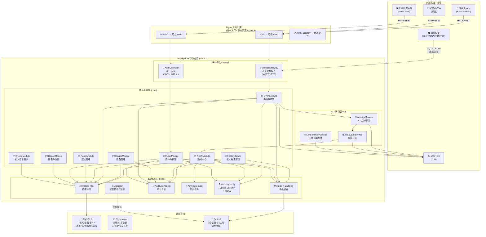
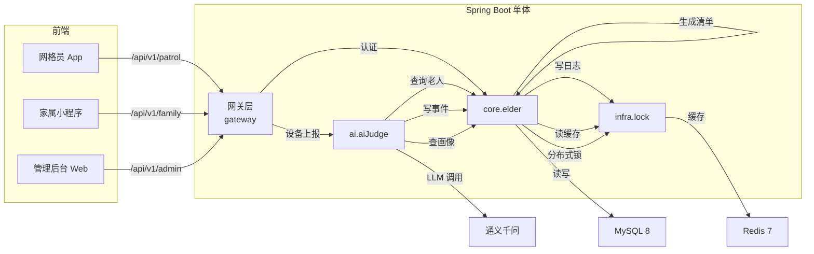

# Silver Guard · 模块归属图（单体架构 · Phase 1）

> 本图对应评审议题 T-02：模块归属确认
> 架构：单体（Spring Boot 3），模块以内包（package）划分，不跨进程
> 通信：模块间通过 Spring Bean（注入）调用；对外暴露通过 Controller REST API
> Dubbo：在 Phase 2 拆分微服务后启用，Phase 1 保留 Dubbo 依赖但暂不暴露为 RPC

---

## 一、整体架构图（Mermaid）



---

## 二、模块包结构（Package Design）

```
com.silverguard
│
├── SilverGuardApplication.java          # 启动类
│
├── config/                             # 全局配置
│   ├── AppConfig.java                   # 业务配置（Nacos / @ConfigurationProperties）
│   ├── WebConfig.java                   # Web 配置（CORS / 拦截器）
│   ├── AsyncConfig.java                 # CompletableFuture 线程池配置
│   ├── CacheConfig.java                 # Caffeine + Redis 多级缓存配置
│   └── SecurityConfig.java              # Spring Security + JWT 配置
│
├── core/                               # 【核心业务层】
│   │
│   ├── elder/                           # 01 老人档案模块
│   │   ├── ElderController.java         # REST API
│   │   ├── ElderService.java             # 业务逻辑
│   │   ├── ElderRepository.java          # MyBatis Flex 查询
│   │   └── domain/
│   │       ├── Elder.java                # 实体
│   │       └── ElderDTO.java             # 传输对象
│   │
│   ├── device/                          # 02 设备管理模块
│   │   ├── DeviceController.java
│   │   ├── DeviceService.java
│   │   ├── DeviceRepository.java
│   │   └── domain/
│   │       ├── Device.java
│   │       └── DeviceStatusVO.java
│   │
│   ├── event/                           # 03 事件与预警模块【核心】
│   │   ├── EventController.java
│   │   ├── EventService.java            # 事件生命周期管理
│   │   ├── EventRepository.java
│   │   ├── EventStatusMachine.java      # 状态机（OPEN→CLOSED）
│   │   └── domain/
│   │       ├── Event.java
│   │       ├── EventLevel.java          # L1~L4 枚举
│   │       └── EventCreateCmd.java
│   │
│   ├── notify/                          # 04 通知中心模块
│   │   ├── NotifyController.java
│   │   ├── NotifyService.java
│   │   ├── NotifyRepository.java
│   │   ├── channel/                     # 通知渠道工厂
│   │   │   ├── NotificationChannel.java  # 接口
│   │   │   ├── AppChannel.java           # App 推送
│   │   │   ├── SmsChannel.java           # 短信
│   │   │   ├── CallChannel.java           # 电话
│   │   │   └── WechatChannel.java         # 微信
│   │   └── escalation/
│   │       └── EscalationStrategy.java  # 升级策略（Strategy 模式）
│   │
│   ├── patrol/                          # 05 巡检管理模块
│   │   ├── PatrolController.java
│   │   ├── PatrolService.java
│   │   ├── PatrolRepository.java
│   │   ├── TaskGenerator.java           # 巡检清单自动生成
│   │   └── domain/
│   │
│   ├── user/                            # 06 用户与权限模块
│   │   ├── AuthController.java           # 登录 / 注册 / JWT
│   │   ├── UserController.java
│   │   ├── UserService.java
│   │   ├── UserRepository.java
│   │   └── domain/
│   │       ├── User.java
│   │       └── Role.java                 # 角色枚举
│   │
│   ├── report/                          # 07 报表与统计模块
│   │   ├── ReportController.java
│   │   ├── ReportService.java
│   │   └── WeeklyReportGenerator.java    # 周报生成（LLM 辅助）
│   │
│   └── profile/                         # 08 老人日常画像模块
│       ├── ProfileService.java
│       └── ProfileRepository.java
│
├── ai/                                 # 【AI / 研判层】
│   ├── AiJudgeService.java              # AI 二次研判入口
│   ├── AiJudgeController.java           # 内部调用（可 Dubbo 暴露）
│   ├── judge/
│   │   ├── JudgeChain.java              # 研判链（Template Method）
│   │   ├── FallDetector.java            # 跌倒识别规则
│   │   ├── StillDetector.java           # 静止识别规则
│   │   └── NightOutDetector.java         # 夜间离床识别
│   ├── RiskLevelDecider.java            # 风险分级策略（Strategy 模式）
│   └── llm/
│       ├── LlmService.java               # LangChain4j 封装
│       ├── LlmSummaryService.java        # LLM 摘要 / 建议生成
│       └── prompt/
│           ├── JudgePrompt.java          # 研判 Prompt
│           └── SummaryPrompt.java        # 周报摘要 Prompt
│
├── gateway/                            # 【接入 / 网关层】
│   ├── DeviceGatewayController.java     # 设备数据统一入口（HTTP / MQTT 转发）
│   ├── AuthController.java              # 认证（手机号+验证码 / SSO）
│   └── GlobalExceptionHandler.java      # 全局异常处理
│
├── infra/                              # 【基础设施层】
│   ├── persistence/
│   │   └── MyBatisFlexConfig.java       # MyBatis Flex 配置
│   ├── cache/
│   │   ├── ElderCacheService.java       # Caffeine 本地缓存
│   │   └── RedisCacheService.java       # Redis 分布式缓存
│   ├── lock/
│   │   └── DistributedLock.java         # Redisson 分布式锁
│   ├── observability/
│   │   ├── MetricsConfig.java           # Micrometer + Prometheus
│   │   └── TraceInterceptor.java         # 全链路 Trace ID
│   ├── audit/
│   │   ├── AuditLog.java                # 审计日志实体
│   │   └── AuditLogAspect.java          # AOP 审计拦截
│   └── notification/
│       └── AsyncNotifyExecutor.java     # CompletableFuture 异步通知执行器
│
└── common/                             # 【公共模块】
    ├── result/
    │   └── ApiResult.java               # 统一响应结构
    ├── exception/
    │   ├── BusinessException.java       # 业务异常
    │   └── ErrorCode.java                # 错误码枚举
    ├── annotation/
    │   ├── RequirePermission.java       # 权限注解
    │   ├── RateLimiter.java              # 限流注解
    │   └── AgentExecution.java          # AI 执行链路注解
    └── util/
        ├── IdCardUtil.java               # 身份证哈希工具
        └── SensitiveUtil.java            # 敏感字段脱敏工具
```

---

## 三、模块归属表（T-02 评审用）

| # | 模块 | 包路径 | 工程归属 | 对外接口 | 依赖模块 | 负责人建议 |
| --- | --- | --- | --- | --- | --- | --- |
| M01 | 老人档案 | `core.elder` | 单体（core） | `GET/POST/PUT /api/v1/elders` | 无 | 老人侧后端 |
| M02 | 设备管理 | `core.device` | 单体（core） | `GET/PUT /api/v1/devices` | M01 | 老人侧后端 |
| M03 | 事件预警 | `core.event` | 单体（core） | `GET /api/v1/events` | M01 M02 | AI 后端（核心） |
| M04 | 通知中心 | `core.notify` | 单体（core） | 内部服务，不对外 | M03 M06 | 后端通用 |
| M05 | 巡检管理 | `core.patrol` | 单体（core） | `GET/POST /api/v1/patrol` | M01 M03 | 网格员侧后端 |
| M06 | 用户权限 | `core.user` | 单体（core） | `POST /api/v1/auth/*` | 无 | 安全/后端 |
| M07 | 报表统计 | `core.report` | 单体（core） | `GET /api/v1/reports/*` | M03 | 数据/后端 |
| M08 | 画像管理 | `core.profile` | 单体（core） | 内部服务 | M01 | AI 后端 |
| M09 | AI 研判 | `ai.*` | 单体（ai） | 内部 Dubbo（Phase 2）/ HTTP | M01 M08 | AI 团队 |
| M10 | 设备网关 | `gateway.device` | 单体（gateway） | `POST /api/v1/devices/report` | M03 | 物联网/后端 |
| M11 | 认证入口 | `gateway.auth` | 单体（gateway） | `POST /api/v1/auth/*` | M06 | 前端/后端 |
| M12 | 审计日志 | `infra.audit` | 单体（infra） | 无，AOP 切入 | 全模块 | 安全/DBA |

---

## 四、关键设计决策（评审重点）

| # | 决策 | 说明 | 评审状态 |
| --- | --- | --- | --- |
| D-01 | 模块间通过 Spring Bean 调用，不跨进程 | Phase 1 单体内，模块间无 Dubbo RPC，直接 `@Autowired` 注入 | ✅ 已确认 |
| D-02 | AI 研判模块在 Phase 2 暴露为 Dubbo Provider | Phase 1 为本地调用，Phase 2 可拆分为独立 AI 服务 | ✅ 已确认 |
| D-03 | 所有 Controller 集中在 `gateway` 包，对外统一 REST API | 便于 Nginx 路由与鉴权拦截 | ✅ 已确认 |
| D-04 | MyBatis Flex 的 Mapper 接口按模块放置，不共用 | 避免跨模块查询耦合 | ⚠️ 需评审 |
| D-05 | 审计日志通过 AOP 切入，不侵入业务代码 | `@AuditLog` 注解 + `AuditLogAspect` | ✅ 已确认 |

---

## 五、模块间依赖关系图（Mermaid）



---

**— 模块归属图结束 —**
**对应评审议题：T-02 · 评审时打印本图作为架构图附件**
